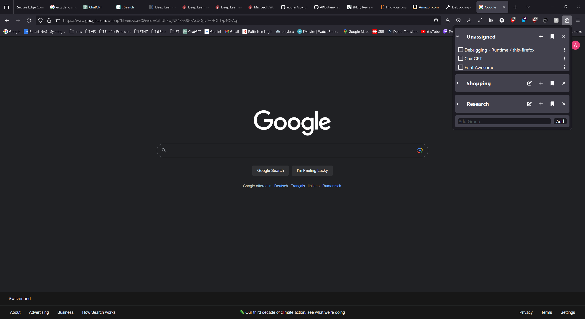

Have you ever struggled with having too many tabs open at the same time and felt the need of organising them into groups? 

This extension solves this exact problem!  


# Features

 - From the popup you can get an overview of all the open tabs organized in groups. 


 - To further organize the tabs, you can separate the group by moving them all into a new window. 

 - Once you are done with them you can close them all at once and remove the group. 

 - To change groups, you have multiple choices: 

    1. Drag and Drop

    

    2. From Options

    

    3. From Tab Selection

    

 - You can save a group as a bookmark, which can be synchronized into multiple devices.

 - You can also reopen any bookmark as a group!

# Testing

I am always looking for testers to get feedback on the extension!

**To test the extension.**
- Clone the repository
- Make sure you have node.js installed.
- open a terminal instance and execute the command ```npm i``` in the location of the repo.
- run the command ```npm run build```. This will create a build folder
- Open firefox and open "about:debugging#/runtime/this-firefox". 
- You'll see a button called "Load Temporary Add-on". Click on it.
- Find the build folder created and open manifest.json.

This should load the firefox extension. Now you can use it like any other extension.

